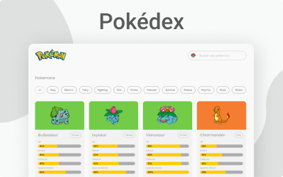

<h1 align="center">📙 Pokédex - Landing Page</h1>

  <strong>Landing page realizada com projeto final do curso de Front-end da b8one.academy</strong>

  

### Site 💻

- [Pokédex](https://pokemons-search.netlify.app/)

## Linguagens: 🚀
- HTML
- CSS
- JavaScript

## Referências: ⌨️

- [Figma](https://www.figma.com/file/CFd1USWtbpCj3gogP6FB7X/Pokemon?node-id=9%3A2)

